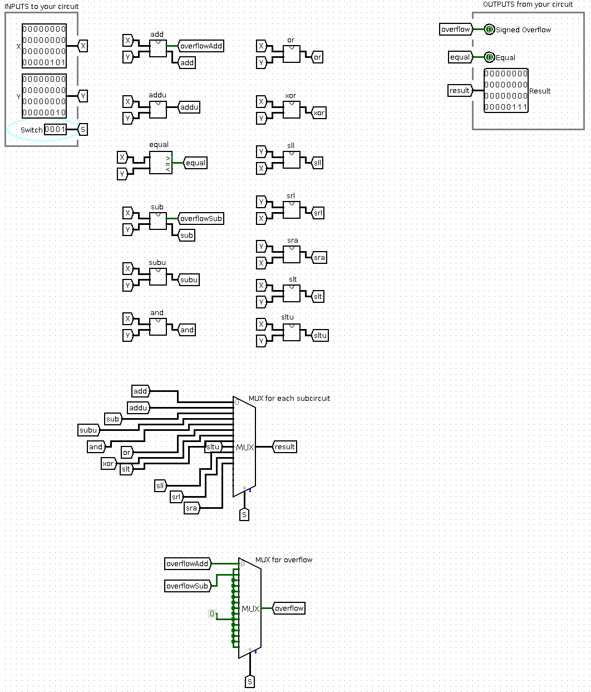

# Processor Project

## Overview
Used Logisim to build a processor that can execute actual assembled MIPS programs.
This is Part 1. The main ALU is constructed.

## Usage
Using the Switch input you can choose which instruction you want to run.
add: 0
addu: 1
sub: 2
subu: 3
and: 4
or: 5
xor: 6
slt: 7
sltu: 8
sll: 9
srl: 10
sra: 11

add and sub detect overflow

## Main ALU

